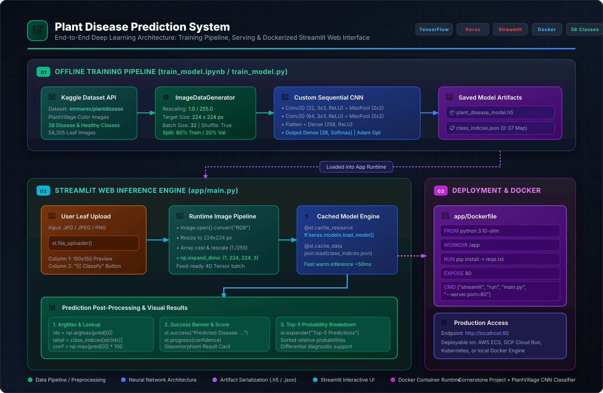

# 🌿 Plant Disease Prediction System

[](https://www.python.org/)
[](https://www.tensorflow.org/)
[](https://streamlit.io/)
[](https://www.docker.com/)
[-10B981?style=for-the-badge&logo=kaggle&logoColor=white)](https://www.kaggle.com/datasets/emmarex/plantdisease)

An end-to-end Deep Learning system for automated plant leaf disease diagnosis. The system uses a Convolutional Neural Network (CNN) trained on the **PlantVillage dataset** (38 disease and healthy categories across 14 crops), served through a responsive, modern **Streamlit** web application, and containerized with **Docker** for production deployment.

---

## 📐 System Architecture & Workflow

The diagram below provides a complete visual overview of the end-to-end pipeline—from dataset ingestion and offline CNN model training to real-time inference serving and containerized deployment.



```mermaid
flowchart TD
    subgraph Phase1["01. Offline Training Pipeline"]
        Kaggle["Kaggle API Ingestion<br/>(emmarex/plantdisease)"] --> RawData["PlantVillage Dataset<br/>54k+ Color Images / 38 Classes"]
        RawData --> Preproc["ImageDataGenerator<br/>• Rescale: 1/255<br/>• Target: 224x224 px<br/>• 80% Train / 20% Val"]
        Preproc --> CNN["Sequential CNN Model<br/>• Conv2D(32, 3x3) + MaxPool<br/>• Conv2D(64, 3x3) + MaxPool<br/>• Flatten + Dense(256)<br/>• Dense(38, Softmax)"]
        CNN --> Fit["Training (model.fit)<br/>Adam Optimizer, Cat. Crossentropy"]
        Fit --> H5["plant_disease_model.h5<br/>(Trained Model Weights)"]
        Fit --> JSON["class_indices.json<br/>(Index to Class Mapping)"]
    end

    subgraph Phase2["02. Runtime Inference & UI"]
        User(["End User"]) -->|Uploads Leaf JPG/PNG| Streamlit["Streamlit Web App (app/main.py)"]
        H5 -.->|@st.cache_resource| Streamlit
        JSON -.->|@st.cache_data| Streamlit
        Streamlit --> ImgPipe["Image Pipeline<br/>Resize 224x224 -> Normalize -> Expand Dims"]
        ImgPipe --> Infer["Model Forward Pass (model.predict)"]
        Infer --> Post["ArgMax & Softmax Decoding"]
        Post --> Results["Visual Output Cards<br/>• st.success(Disease Name)<br/>• Confidence Metric & Progress Bar<br/>• Top-5 Differential Diagnosis"]
    end

    subgraph Phase3["03. Deployment"]
        AppFiles["app/ Directory<br/>main.py + Dockerfile + artifacts"] --> DockerBuild["Docker Build (python:3.10-slim)"]
        DockerBuild --> Container["Production Docker Container<br/>Listening on Port 80"]
        Container --> WebBrowser(["Browser Client :80"])
    end

    H5 ==> AppFiles
    JSON ==> AppFiles
```

---

## 🗂 Project Structure

```text
cornerstone_project/
├── systemflow.svg                     # High-resolution architectural system flow diagram
├── readme.md                          # Master project documentation
└── plant-disease-predictor/
    ├── requirements.txt               # Complete Python dependencies for local training
    ├── train_model.ipynb              # Interactive Jupyter Notebook for data prep & CNN training
    ├── train_model.py                 # Standalone script for automated pipeline execution
    └── app/
        ├── main.py                    # Streamlit web app with custom glassmorphism styling
        ├── Dockerfile                 # Docker container deployment configuration
        ├── requirements.txt           # Lean dependencies for containerized web serving
        ├── class_indices.json         # 38-class index-to-disease JSON dictionary
        └── trained_model/
            └── plant_disease_model.h5 # Serialized trained CNN model weights
```

---

## 🧠 Convolutional Neural Network (CNN) Architecture

The model is engineered using TensorFlow / Keras Sequential API, optimized for high feature extraction capacity while maintaining low inference latency on standard CPUs:

| Layer | Type | Specifications | Output Shape | Activation |
|---|---|---|---|---|
| **Input** | InputLayer | RGB Leaf Image | `(None, 224, 224, 3)` | — |
| **Block 1** | Conv2D | 32 filters, 3x3 kernel, stride 1 | `(None, 222, 222, 32)` | ReLU |
| | MaxPooling2D | 2x2 pool size | `(None, 111, 111, 32)` | — |
| **Block 2** | Conv2D | 64 filters, 3x3 kernel, stride 1 | `(None, 109, 109, 64)` | ReLU |
| | MaxPooling2D | 2x2 pool size | `(None, 54, 54, 64)` | — |
| **Head** | Flatten | Flatten feature maps to 1D | `(None, 186624)` | — |
| | Dense | 256 hidden units | `(None, 256)` | ReLU |
| **Output** | Dense | 38 units (1 per disease class) | `(None, 38)` | Softmax |

### Training Hyperparameters
- **Optimizer:** `Adam` (`learning_rate=0.001`)
- **Loss Function:** `categorical_crossentropy`
- **Evaluation Metric:** `accuracy`
- **Batch Size:** `32`
- **Validation Split:** `20%` (validation_split=0.2)
- **Input Resolution:** `224 × 224 × 3` normalized to `[0.0, 1.0]`

---

## 🌐 Streamlit Application Features

The web frontend in [`app/main.py`](file:///c:/Users/vivek/sem5/cornerstone_project/plant-disease-predictor/app/main.py) is built with modern user experience principles:

1. **Dark Mode & Glassmorphism Design:** Curated palette (`#0f2027` to `#2c5364`), semi-transparent frosted-glass containers, and smooth green accents.
2. **Dual-Column Layout:** 
   - **Column 1:** Formatted leaf image preview (150×150 px).
   - **Column 2:** Single-click "🔬 Classify" action.
3. **Performance Optimization:**
   - Model weights loaded once and persisted via `@st.cache_resource`.
   - Class dictionary loaded once via `@st.cache_data`.
4. **Comprehensive Diagnostic Output:**
   - Instant confirmation via `st.success()`.
   - Confidence percentage calculation and interactive progress bar.
   - Expandable **Top-5 Predictions breakdown** providing differential diagnosis probabilities.

---

## 🌿 Supported Plant Species & Disease Classes (38 Total)

The model supports diagnosis across 14 commercial agricultural crops:

| Crop | Supported Diagnoses / Classes |
|---|---|
| **Apple** | Apple Scab, Black Rot, Cedar Apple Rust, Healthy |
| **Blueberry** | Healthy |
| **Cherry (incl. sour)** | Powdery Mildew, Healthy |
| **Corn (Maize)** | Cercospora Leaf Spot (Gray Leaf Spot), Common Rust, Northern Leaf Blight, Healthy |
| **Grape** | Black Rot, Esca (Black Measles), Leaf Blight (Isariopsis Leaf Spot), Healthy |
| **Orange** | Huanglongbing (Citrus Greening) |
| **Peach** | Bacterial Spot, Healthy |
| **Pepper (Bell)** | Bacterial Spot, Healthy |
| **Potato** | Early Blight, Late Blight, Healthy |
| **Raspberry** | Healthy |
| **Soybean** | Healthy |
| **Squash** | Powdery Mildew |
| **Strawberry** | Leaf Scorch, Healthy |
| **Tomato** | Bacterial Spot, Early Blight, Late Blight, Leaf Mold, Septoria Leaf Spot, Spider Mites (Two-Spotted Spider Mite), Target Spot, Tomato Yellow Leaf Curl Virus, Tomato Mosaic Virus, Healthy |

---

## 🚀 Quick Start Guide

### Prerequisites
- Python 3.10+
- (Optional) Docker Engine for containerized deployment
- (Optional) Kaggle API token (`kaggle.json`) for downloading training data

---

### Method A: Local Setup & Running the Web App

#### 1. Navigate to the project directory
```bash
cd plant-disease-predictor
```

#### 2. Create and activate a virtual environment
```bash
# Windows
python -m venv venv
.\venv\Scripts\activate

# Linux / macOS
python3 -m venv venv
source venv/bin/activate
```

#### 3. Install dependencies
```bash
pip install -r requirements.txt
```

#### 4. Launch the Streamlit application
```bash
streamlit run app/main.py
```
Access the application at `http://localhost:8501`.

---

### Method B: Training the CNN Model

#### 1. Set up Kaggle credentials
Place your `kaggle.json` in:
- **Windows:** `C:\Users\<Username>\.kaggle\kaggle.json`
- **Linux/macOS:** `~/.kaggle/kaggle.json`

#### 2. Run the training workflow
You can train using either the interactive Jupyter notebook:
```bash
jupyter notebook train_model.ipynb
```
Or execute the standalone training script:
```bash
python train_model.py
```
Upon completion, the trained weights (`plant_disease_model.h5`) will be saved into `app/trained_model/` and `app/class_indices.json` will be generated.

---

### Method C: Deployment with Docker

Containerizing the application ensures consistent runtime environments across any cloud platform or host OS.

#### 1. Build the Docker image
```bash
cd plant-disease-predictor/app
docker build -t plant-disease-classifier .
```

#### 2. Run the Docker container
```bash
docker run -d -p 80:80 --name plant-disease-app plant-disease-classifier
```

#### 3. Access the deployed app
Open your web browser and navigate to:
```
http://localhost:80
```

---

## 🛠 Tech Stack Details

| Component | Technology | Version | Purpose |
|---|---|---|---|
| **Core Framework** | TensorFlow / Keras | 2.13.0 | CNN modeling, training, and inference |
| **Image Processing** | Pillow (PIL) | 10.0.1 | Leaf image ingestion and preview resizing |
| **Data Processing** | NumPy | 1.24.3 | Tensor formatting and probability arrays |
| **Web Interface** | Streamlit | 1.28.0 | Interactive web app UI and model serving |
| **Deployment** | Docker | 3.10-slim | Containerized lightweight deployment |
| **Dataset Source** | Kaggle API | 1.5.16 | Automated download of PlantVillage corpus |

---

## 📄 License & Attribution
- **Dataset:** [PlantVillage Dataset](https://www.kaggle.com/datasets/emmarex/plantdisease) provided by Penn State University / Emma Rex.
- **Project Type:** Academic & Engineering Capstone Project.
